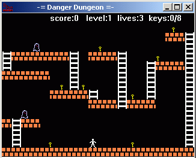

 
Danger Dungeon
--
 
 
This is my second playeble game. It written under Borland C++
as Galaxian too but with NukeDX wrapper. The game is simplefer
Loderunner clone (without floor breaking).
I use separate application for create levels-
 <a class="pagelink" href="levedit.html">level editor</a> which I wrote long before of write this game.
Level format is ugle (no check byte order, depends on compiller-specific
structure alligment in memory).
 
 
Platform: Windows, DirectX
 
 
NOTE: runs only in 16-bit display color mode.
 
## Downloads
 - <a href="files/ddungeon-exe.zip">ddungeon-exe.zip
  (316 Kb)</a>   - Windows executable and data 
 - <a href="files/ddungeon-src.zip">ddungeon-src.zip
  (28 Kb)</a>   - Source and project for Borland C++ Builder 5 
  
 
