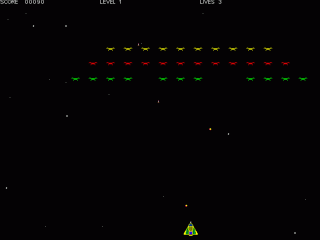

 
galaxian
--
 
 
Simple cosmic shooter game written in Borland C++ Builder
and pure DirectX API long time ago in education purpuse.
This is first my playable game for PC.
Source code of this game is the night mare. I try to port it
to SDL and was fail.
Possible I rewrite it in C++/SDL or Pyton/PyGame soon.
 
 
Platform: Windows, DirectX
 
## Downloads
 - <a href="files/galaxian-exe.zip">galaxian-exe.zip
  (500 Kb)</a>   - win32 executable and arts 
 - <a href="files/galaxian-1.1-src.zip">galaxian-1.1-src.zip
  (20 Kb)</a>   - source code 
  
 
