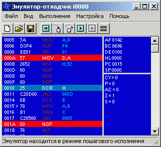

i8080 emulator
--

 
 
I wrote this emulator as my graduate work for an engeneer degree
in Jan-May 2003 using Borland C++ Builder 5.

Why didn't I start writting it in GTK+ at the begining?
At the moment I have no experience with GTK+ / Qt and fear of failure
stopped me. Another reason was I didn't know a good cross-platform help system
so Help file is written entirely in RTF for help compiler.

Platform: Windows

I still hope I can rewrite it using Qt, GTK+ or wxWindow user interface library
for make it cross platform compatibility.
 
Downloads
---
 - <a href="files/i8080emu.zip">i8080emu.zip (1092 Kb)</a> Binary and help files
 - <a href="files/i8080emu-src.zip">i8080emu-src.zip (320 Kb)</a> Source code
 - <a href="files/i8080asm-1.1.tgz">i8080asm-1.1.tgz (24 Kb)</a>
     i8080 assembler as separate Unix source package 
  
Links
---
 - <a href="http://sourceforge.net/projects/i8086emu">http://sourceforge.net/projects/i8086emu</a>
   This is multi-platform emulator for Intel 8086 microprocessor with GUI debbuger
     and plugins for hardware emulation 
 - <a href="http://fuse-emulator.sourceforge.net">http://fuse-emulator.sourceforge.net</a>
     The Free Unix Spectrum Emulator
 - <a href="http://crasm.sourceforge.net/crasm.html">http://crasm.sourceforge.net/crasm.html</a>
Cross assembler for 6800/6801/6803/6502/65C02/Z80
Assemble a microprocessor program and produce output file in Intel HEX
or Motorola S Code from source for 6800/6801/6803/6502/65C02/Z80
processors. A program listing and a symbol table are also produced
on the standard output.
