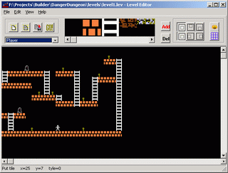

 
Level Editor
--
 
 
My first serious project on PC written in 2000.
So I just migrate from speccy, I not think about cross platform
compatibility, so I store levels in bad (my grown) file format:
it directly dumps C-structure object to disk with <i>write()</i>
call so it no check byte order and depends on compiller-specific
structure alligment in memory.
 
 
Platform: Windows
 
 
Now I find good file format (standard and portable) for store
tile map and objects on it with initial possitions and other properties
which fit for games like Dizzy, LodeRunner and other 2D actions.
If you know such format please let me know.
 
## Downloads
 - <a href="files/leveditor.zip">leveditor.zip
  (416 Kb)</a>   - Windows executable and help file 
 - <a href="files/levedit-src.zip">levedit-src.zip
  (32 Kb)</a>   - Source for C++ builder 
  
## Links
 - <a href="http://tilestudio.sourceforge.net/">http://tilestudio.sourceforge.net/</a> -  Tile Studio is a complete development utility for
  graphics of tile-based games. The application contains a bitmap
  editor for creating tiles and sprites and a map editor for designing
  level maps.      
 - <a href="http://rpgmapper.sourceforge.net/">http://rpgmapper.sourceforge.net/</a> -  RPG Mapper is the good tile map editor whitch have objects, crossplatform (java)      
 - <a href="http://cleangl.sourceforge.net">http://cleangl.sourceforge.net</a> -  The Clean Game Library is a complete development system for 2D
  games (arcade, side scrollers, platform games), using the functional
  language Clean. Allthough Clean is not easy to learn (it's very
  different from imperative languages, such as Pascal and C), once you
  have mastered programming in Clean, you can easily create games with
  the Clean Game Library.      
  
 
