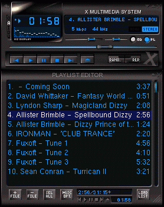

 
libayemu
--

 

libayemu - is AY/YM sound chip emulation library written in ANSI C,
so it can be ported to any OS with little or no change.

AY/YM sound chip was used in wide range of old popular machines
such as Sinclair ZX Spectrum 128, Commodore Atari and others.

This library has: 
 - doxygen API documentation;
 - autotools build system;
 - sample: xmms plug-in (on the picture);
 - sample: console player for *nix;
 
Downloads
--
 
Visit the project's download page on 
 <a href="http://sourceforge.net/project/showfiles.php?group_id=107596">SourceForge</a>

You can contribute by:
 - create build of libayemu and player for Windows;
 - write input plugin for any existing sound player;
 - create Python binding;

Currently the library is used in **DeadBeef** music player (cross-platform).

History
--
 
<a href="mailto:v_soft@microfor.ru">Roman Sherbakov</a> is original author of
Winamp plugin (in_vtx.dll) for playing AY/YM music in VTX format.
It was open source, but in Delphi and asm :-(  So I can't directly
port it to Linux and start rewritting it in C. Month after I drop
mail to Roman for request help and following develop we do in pair:
I was responceable for code, Roman for synthezer algoritm.
His site is <a href="http://vtx.microfor.ru">http://vtx.microfor.ru</a>.
 
 
## Links
 - [AY-3-8910](https://ru.wikipedia.org/wiki/AY-3-8910)
 - [AY-3-8910, AY-3-8912, YM2149 Homepage](http://bulba.untergrund.net/)
 - <a href="http://trd.speccy.cz/">http://trd.speccy.cz/</a> -  Virtual TR-DOS
 - <a href="http://www.worldofspectrum.org/">http://www.worldofspectrum.org/</a> -  World of Spectrum
 - <a href="http://www.worldofspectrum.org/projectay/">http://www.worldofspectrum.org/projectay/</a> -  Project AY on <b>World of Spectrum</b>
 - <a href="http://vtx.microfor.ru">http://vtx.microfor.ru</a> -  V_Soft Home Page
 - <a href="http://zxdimsla.chat.ru/WINAMP/winamp.htm">http://zxdimsla.chat.ru/WINAMP/winamp.htm</a> -  The ways to listen &amp; to convert ZX-Spectrum music modules
 - <a href="http://oldcomputers.com/">http://oldcomputers.com/</a> -  Old computers museum
