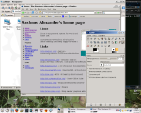

 
 
Linux
--
 
I use Linux OS at work and at home. The main advantages of
this OS- freely and flexible. Also here one disadvantage
for home use- games. Since I not playing it I can successfully
use Linux. Here some related links:
 
## Links
 - <a href="http://freedesktop.org/">http://freedesktop.org/</a> -  Standards for desktop environment     
 - <a href="http://refspecs.freestandards.org/lsb.shtml">http://refspecs.freestandards.org/lsb.shtml</a> -  LSB - Linux Standard Base     
 - <a href="http://debian.org/">http://debian.org/</a> - Community-driven greatest GNU/Linux distribution    
 - <a href="http://debian.org/">http://debian.org/</a> - Community-driven greatest GNU/Linux distribution    
 - <a href="http://mozilla.org/">http://mozilla.org/</a> - Mozilla Firefox web browser    
 - <a href="http://kde.org/">http://kde.org/</a> - KDE - K Desktop Environment    
 - <a href="http://http://openoffice.org/">http://http://openoffice.org/</a> - Open Office Suite    
 - <a href="http://www.gimp.org/">http://www.gimp.org/</a> - Gimp raster graphics editor    
 - <a href="http://emacs.gnu.org/">http://emacs.gnu.org/</a> - Emacs    
 - <a href="http://freshmeat.net/">http://freshmeat.net/</a> - Greatest search engine for free software    
 - <a href="http://www.jpilot.org/">http://www.jpilot.org/</a> - Desktop for the Palm Pilot    
 - <a href="http://gaim.org/">http://gaim.org/</a> - Gaim - multi-protocol instant messaging client    
 - <a href="http://xmms.org/">http://xmms.org/</a> - XMMS - Winamp's clone audio player    
 - <a href="http://k3b.org/">http://k3b.org/</a> - K3B - exelent CD/DVD burning programm    
 - <a href="http://xinehg.de/">http://xinehg.de/</a> - Xine media player    
 - <a href="http://winehq.org/">http://winehq.org/</a> - WINE - Windows(tm) emulator    
 - <a href="http://memtest86.com/">http://memtest86.com/</a> -  Memtest86 - A Stand-alone Memory Diagnostic    
 - <a href="http://opennet.ru/">http://opennet.ru/</a> - a lot of russian documentation about Linux    
  
  
 
 
