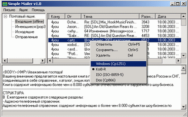

 
Simple Mailer
--
 
 
Simple POP3/SMTP client written on Builder C++ components.
Fit to put on floppy disk to run and work directly from floppy.
Usefull for people who check mail on various computers.
 
 
Почтовый клиент. Программа задумывалась как простой почтовый клиент, который 
можно было бы записать на дискету и приходить с ней в места, где есть интернет 
для проверки новой почты и отправления заранее написанных сообщений. Она будет 
полезна людям, имеющим дома компьютер без интернета и вынужденых проверять почту 
откуда придется.
 
## Downloads
 - <a href="files/mailer.zip">mailer.zip
  (332 Kb)</a>   - Дистрибутив 
 - <a href="files/mailer-src.zip">mailer-src.zip
  (44 Kb)</a>   - Исходники 
  
  Note: exacutable compressed with <b>PECompact</b>
 
## Links
 - <a href="http://sylpheed.good-day.net/en/">http://sylpheed.good-day.net/en/</a> -  Sylpheed is a simple, lightweight but featureful, and easy-to-use e-mail client.     
  
 
