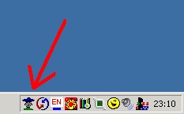

 
Overhearer
--
 
 
Подслушивалка. При запуске сразу прячет свое окно и помещает свою иконку на 
панель рядом с часами. При одинарном щелчке на ней включает запись с микрофона 
в файл и меняет картинку на иконке для индикации того, что запись включена. 
При повторном одинарном щелчке по иконке запись выключается и программа закрывается
 
 
По щелчку правой кнопкой на иконке появляется меню, из которого можно выбрать формат 
записи ( из доступных системе форматов для записи) и папку, в которую будет 
производиться запись (рекомендую выбрать диск, на котором больше места, т.к. 
выходной файл несжатый). Настройки вступают в силу при старте записи, т.е. если 
запись уже идет и вы измените настройки, на текущую запись они не повлияют.
 
## Downloads
 - <a href="files/overhearer-exe.zip">overhearer-exe.zip
  (312 Kb)</a>   - executable for win32 
 - <a href="files/overhearer-src.zip">overhearer-src.zip
  (12 Kb)</a>   - source code for Builder C++ 5 
  
 
Executable is big because standard VCL library is staticaly compiled.
If you have Builder C++ 5 installed it is better to download and compile
from source for safe your internet traffic.
 
 
Under Linux you can easily use 'sox' programm for it:
 
<pre>
# your ~/.bashrc:
alias rec="sox -t ossdsp /dev/dsp ~/snd/date.gsm &amp;"
alias stoprec="killall sox"
</pre>
 
Do command 'rec' for start recording and 'stoprec' for stopping.
You can run this command in console or, the better, in applet in KPannel
or by Alt+F2 (in KDE).
 
## Links
 - <a href="http://virtualsoft.narod.ru">http://virtualsoft.narod.ru</a> - MiniRecorder- similar programm but executable is ~40 kb,
    works fine under WinXP and write data directly to mp3.    
  
 
