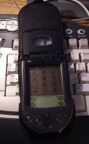

 
PalmOS
--
 
 
I use my <b>Palm m105</b> since Jul 2003. Generally I use it for
to-do list, calendar with reminders, address book, e-book reader,
english-russian dictionary, notes store and keyring for internet (crypted
login:password storage). Of cause, all volume information regulary backup to desktop
computer and weekly backup to internet in crypted form. Here links to software:
 
## Links
 - <a href="http://plkr.org/">http://plkr.org/</a> -  Plucker (GPL) - the best offline HTML and ebook reader for Palm devices     
 - <a href="http://gnukeyring.sourceforge.net/">http://gnukeyring.sourceforge.net/</a> -  Keyring (GPL) for Palm OS     
 - <a href="http://mikemccollister.com/palm/">http://mikemccollister.com/palm/</a> -  TikTok (GPL) - Timers     
 - <a href="http://sourceforge.net/projects/dicengrus/">http://sourceforge.net/projects/dicengrus/</a> -  DicEngRus (Freeware)     
 - <a href="http://nosleep.net/">http://nosleep.net/</a> -  FileZ (Freeware) - Advanced file manager for PalmOS     
 - <a href="http://www.stacken.kth.se/~foo/pilot/noblemoor.shtml">http://www.stacken.kth.se/~foo/pilot/noblemoor.shtml</a> -  Noble Moor (GPL) is an Othello/Reversi game     
 - <a href="http://www.usinglinux.org/palm/">http://www.usinglinux.org/palm/</a> -  Articles and soft related using Palm with Linux desktop     
  
 
