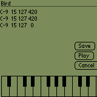

 
Palmano (Palm Piano)
--
 
 
This project still in pre-alpha stage.
I start writting it in Aug 2003 (month after I get Palm m105) but from
Nov 2003 I (in same time) start work in SWsoft and spend time with my girl frien
and amount of free time drammaticaly decreases.
 
 
Platform: PalmOS 3.5
 
 
This is system sound editor for PalmOS 3.5 with screen midi (piano form) keyboard.
You may select note by tap on it and then save medoly to system and use it
as alarm sound in clock or datebook application.
 
## Links
 - <a href="http://palm.com">http://palm.com</a> -  Home of manufacter of Palm devices     
 - <a href="http://sourceforge.net/softwaremap/trove_list.php?form_cat=223">http://sourceforge.net/softwaremap/trove_list.php?form_cat=223</a> -  project on SourceForge for PalmOS     
 - <a href="http://sourceforge.net/projects/pdbfile/">http://sourceforge.net/projects/pdbfile/</a> -  PDB file parsing C++ library for Linux     
  
 
