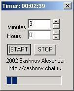

 
Timer
--
 
 
Simple revers timer. Prototype is hardware parking timer.
You specify time in hour and minutes and start back count.
When time out it get the sound signal.
 
 
Platform: Windows (pure Win32 API, C programming language)
 
 - <a href="files/timer-exe.zip">timer-exe.zip
  (8 Kb)</a>   - Windows executable 
 - <a href="files/timer-src.zip">timer-src.zip
  (8 Kb)</a>   - Source for windows (used win32 API) 
 - <a href="files/timer_old-src.zip">timer_old-src.zip
  (8 Kb)</a>   - another source in Borland C++ Builder 
 
