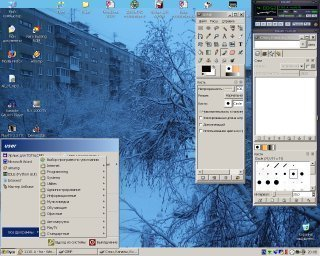

 
Software for windows
--
 
 
  Since I connect to local network (May 2006) I stop use windows at home too.
But many my friends and other people continue use it for different reasons.
Many of great free software also have version for Windows. Some of great
free software peaces was written especially for Windows. Here is links:
 
## Links
 - <a href="http://mozilla.org/">http://mozilla.org/</a> - Firefox - lightweight web browser based on Mozilla    
 - <a href="http://openoffice.org/">http://openoffice.org/</a> - Open Office Suite    
 - <a href="http://www.gimp.org/">http://www.gimp.org/</a> - The Gimp - The GNU Image Manipulation Program    
 - <a href="http://inkscape.org/">http://inkscape.org/</a> -  Inkscape is an Open Source vector graphics editor,
     with capabilities similar to Illustrator, Freehand, CorelDraw, or Xara X.    
 - <a href="http://www.irfanview.com/">http://www.irfanview.com/</a> -  IrfanView - Universal picture viewer.     
 - <a href="http://gaim.sourceforge.net/">http://gaim.sourceforge.net/</a> -  A multi-protocol instant messaging (IM) client)     
 - <a href="http://www.7-zip.org/">http://www.7-zip.org/</a> -  7-Zip - a file archiver for Windows.
     It supports zip, 7zip, rar, arj and much more.    
 - <a href="http://www.chrysocome.net/explore2fs">http://www.chrysocome.net/explore2fs</a> - explore2fs - the Linux file system utility for Windows NT    
 - <a href="http://freealternatives.org/">http://freealternatives.org/</a> -  contributed list of open source alternatives to popular software     
  
  
 
